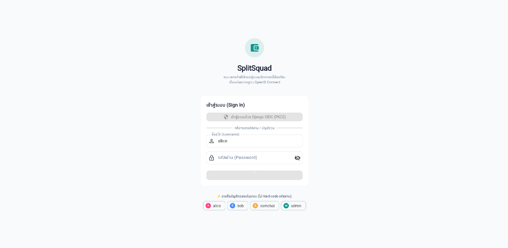

# 💸 SplitSquad — Group Expense & Bill Splitter

แอปพลิเคชันจัดการและหารค่าใช้จ่ายกลุ่มสำหรับเพื่อนร่วมทริป รูมเมท หรือเพื่อนร่วมงาน สรุปยอดหนี้สุทธิและเคลียร์เงินกันได้แบบเรียลไทม์ เชื่อมต่อความปลอดภัยระดับสากลด้วย **OpenID Connect (OIDC)**

---

## ① ชื่อโปรเจกต์และคำอธิบาย (About Project)

### 📌 ปัญหาที่เราพบเจอ (The Problem)
เวลาไปเที่ยวต่างจังหวัดกับแก๊งเพื่อน ไปกินชาบูกับเพื่อนที่ทำงาน หรือแชร์ค่าหอกับรูมเมท มักเจอปัญหาชวนปวดหัวเสมอ:
- ต่างคนต่างช่วยกันจ่ายคนละบิล สับสนว่าใครจ่ายอะไรไปแล้วบ้าง
- คำนวณหายอดสุทธิยาก ต้องมานั่งกดเครื่องคิดเลขทอนเงินไปมา
- ความเกรงใจทำให้ลืมทวง หรือลืมว่าตัวเองยังติดเงินเพื่อนอยู่เท่าไร

### 🎯 เราแก้ปัญหาอย่างไร และใครคือผู้ใช้งาน? (The Solution & Audience)
**SplitSquad** ถูกสร้างขึ้นเพื่อกลุ่มเพื่อน นักศึกษา รูมเมท และเพื่อนร่วมงาน:
- ช่วยให้ทุกคนสามารถบันทึกบิลที่ตัวเองเป็นคนจ่าย เลือกว่ามีใครเป็นคนร่วมหารบ้าง
- ระบบจะคำนวณ **ยอดหนี้สุทธิ (Net Balance)** ให้ทันทีแบบเรียลไทม์ ทำให้เห็นภาพชัดเจนว่า *"สรุปแล้วฉันติดใครเท่าไร"* หรือ *"ใครต้องคืนเงินฉันบ้าง"*
- มีปุ่มบันทึกการคืนเงิน (**Settle Debt**) เพื่อตัดยอดหนี้อัตโนมัติเมื่อเพื่อนโอนเงินคืนเรียบร้อยแล้ว

---

## ② ฟีเจอร์การใช้งาน (Features)

### ✨ ฟีเจอร์หลัก (Core Features)
- [x] **OIDC Authentication (PKCE Flow):** เข้าสู่ระบบผ่าน OpenID Connect Identity Provider (`django-oidc-provider`) โดยแอปไม่ยุ่งเกี่ยวและไม่เก็บรหัสผ่านไว้ในเครื่องตามมาตรฐานความปลอดภัย
- [x] **Persistent Session:** จำสถานะการล็อกอินไว้ในเครื่อง ปิดแอปหรือรีเฟรชหน้าเว็บก็ยังใช้งานต่อได้ทันที
- [x] **Create Expense:** บันทึกบิลค่าใช้จ่าย ระบุชื่อ ยอดเงิน หมวดหมู่ หมายเหตุ และเลือกสมาชิกผู้ร่วมหารได้อิสระ
- [x] **Read & Balance Overview:** แสดงรายการบิลทั้งหมด พร้อมสรุปยอดหนี้สุทธิรวม และยอดคงค้างแยกรายบุคคลแบบชัดเจน
- [x] **Update Expense (Edit):** แก้ไขรายละเอียดบิล ยอดเงิน หรือคนร่วมหารย้อนหลังได้ โดยระบบจะคำนวณส่วนแบ่งหนี้ใหม่ให้อัตโนมัติ
- [x] **Delete Expense:** ลบบิลที่ไม่ต้องการ พร้อมหน้าต่างยืนยันป้องกันการกดผิด
- [x] **Debt Settlement:** บันทึกการคืนเงินระหว่างเพื่อน เพื่อตัดยอดหนี้ที่ค้างชำระกันอยู่

### 🌙 ฟีเจอร์เสริมพิเศษ (Extra Features)
- [x] **Dark Mode (โหมดกลางคืน):** สลับธีมมืด/สว่างได้ง่าย ๆ ผ่านปุ่มพระจันทร์บนแถบ AppBar หรือหน้า Profile พร้อมจำการตั้งค่าไว้ในเครื่อง
- [x] **Friend Request & Friends Management:** สมัครสมาชิกบัญชีใหม่ได้ด้วยตนเอง มีระบบส่งคำขอเพิ่มเพื่อนด้วยการระบุ Username ของผู้อื่น โดยผู้รับสามารถเลือกยอมรับ (Accept) หรือปฏิเสธ (Reject) คำขอได้ และแสดงเฉพาะเพื่อนที่เชื่อมต่อกันแล้วในการหารบิล
- [x] **Category Filter:** แถบเลือกกรองดูค่าใช้จ่ายตามหมวดหมู่ เช่น อาหาร, การเดินทาง, ที่พัก, บันเทิง, ช้อปปิ้ง

---

## ③ เทคโนโลยีที่ใช้ (Tech Stack)

### 📱 Frontend (Mobile & Web)
- **Flutter Version:** `3.47.x` (Dart `3.13.x`)
- **State Management & DI:** `provider` (MVVM Architecture: Models, Views, ViewModels, Repositories, Services)
- **HTTP Client:** `dio` (Stateless Network Client พร้อมแนบ Bearer Token)
- **Local Storage:** `shared_preferences` (จัดการ Session Token และ Theme Mode)
- **Crypto & Security:** `crypto` (คำนวณ SHA-256 Code Challenge สำหรับ PKCE)
- **Date & Number Formatting:** `intl`

### 🖥️ Backend
- **Framework:** `Django 5.x` + `Django REST Framework`
- **Package & Environment Manager:** `uv` (Astral's extremely fast Python package manager)
- **OIDC Provider:** `django-oidc-provider` (มาตรฐาน OpenID Connect, RS256 JWT, PKCE S256)
- **CORS Handling:** `django-cors-headers`
- **Database:** `SQLite` (พร้อมระบบ Auto-seed ข้อมูลเริ่มต้น)

---

## ④ สิ่งที่ต้องติดตั้งก่อนรัน (Prerequisites)

ก่อนเริ่มต้นรันระบบ กรุณาตรวจสอบว่าในเครื่องมีโปรแกรมเหล่านี้ติดตั้งเรียบร้อยแล้ว:

1. **Python (เวอร์ชัน 3.10 ขึ้นไป)** — [ดาวน์โหลด Python](https://www.python.org/downloads/)
2. **uv (ตัวจัดการแพ็กเกจ Python)** — [คู่มือติดตั้ง uv](https://docs.astral.sh/uv/getting-started/installation/)
   *(สำหรับ Windows ติดตั้งผ่าน PowerShell: `powershell -ExecutionPolicy ByPass -c "irm https://astral.sh/uv/install.ps1 | iex"` หรือ `pip install uv`)*
3. **Flutter SDK (เวอร์ชัน 3.x ขึ้นไป)** — [คู่มือติดตั้ง Flutter](https://docs.flutter.dev/get-started/install)
4. **Google Chrome** — [ดาวน์โหลด Google Chrome](https://www.google.com/chrome/)

---

## ⑤ วิธีการรันระบบทีละขั้นตอน (How to Run)

เปิด **Terminal 2 หน้าต่าง** แล้วรันคำสั่งตามลำดับดังนี้:

### 🔹 Terminal 1: ฝั่ง Backend (Django OIDC Server)
```bash
# 1. เข้าไปที่โฟลเดอร์ backend
cd backend

# 2. ติดตั้ง Library ทั้งหมดผ่าน uv
uv sync

# 3. รัน Migration ฐานข้อมูล
uv run manage.py migrate

# 4. สร้างผู้ใช้ทดสอบและ OIDC Client เริ่มต้น
uv run manage.py seed_splitsquad_data

# 5. เริ่มต้นเซิร์ฟเวอร์ Backend ที่พอร์ต 8000
uv run manage.py runserver 0.0.0.0:8000
```
> เซิร์ฟเวอร์ Backend จะพร้อมทำงานที่ `http://127.0.0.1:8000`

---

### 🔹 Terminal 2: ฝั่ง Frontend (Flutter Web)
```bash
# 1. เข้าไปที่โฟลเดอร์ frontend
cd frontend

# 2. ดาวน์โหลดแพ็กเกจ Flutter
flutter pub get

# 3. ตรวจสอบความถูกต้องของโค้ดและการทดสอบ (Zero Issues)
flutter analyze
flutter test

# 4. รันแอปพลิเคชันบนเบราว์เซอร์ Chrome ที่พอร์ต 50000
flutter run -d chrome --web-port 50000
```
> เบราว์เซอร์จะเปิดแอป SplitSquad ขึ้นมาที่ `http://localhost:50000`

---

## ⑥ บัญชีสำหรับทดสอบ (Demo Accounts)

สามารถใช้บัญชีผู้ใช้ทดสอบด้านล่าง เพื่อล็อกอินที่หน้า OIDC Server:

| Username | Password | ชื่อที่แสดง | รายละเอียดในระบบ |
| :--- | :--- | :--- | :--- |
| **`alice`** | `alice123` | Alice Chen | *(แนะนำ)* มีทั้งยอดที่เพื่อนติดและยอดที่ติดเพื่อน เหมาะสำหรับทดสอบดู Balance |
| **`bob`** | `bob123` | Bob Smith | สมาชิกร่วมหารบิลค่าอาหารและทริป |
| **`somchai`** | `somchai123` | Somchai Jaidee | สมาชิกร่วมหารบิล |
| **`admin`** | `admin123` | System Admin | ผู้ดูแลระบบ (Superuser) |

*ขั้นตอนการล็อกอิน: กดปุ่ม **"เข้าสู่ระบบด้วย OpenID Connect"** ที่หน้าแอป ระบบจะพาไปกรอก Username และ Password ที่หน้าเว็บของ OIDC Server เมื่อยืนยันตัวตนสำเร็จจะส่งกลับมาที่ Dashboard ทันที*

---

## ⑦ ภาพหน้าจอการทำงาน (Screenshots)

### 1. หน้าเข้าสู่ระบบ (OIDC Sign In)
หน้าจอเข้าสู่ระบบแบบ Single Sign-On สไตล์มินิมอล ส่งต่อไปยืนยันตัวตนที่ Identity Provider โดยแอปไม่เก็บรหัสผ่านในเครื่อง



### 2. หน้าแดชบอร์ดสรุปยอดหนี้ (Dashboard & Net Balance)
แสดงภาพรวมยอดหนี้สุทธิ (เราติดเพื่อน / เพื่อนติดเรา), แถบกรองหมวดหมู่ค่าใช้จ่าย และรายการประวัติบิลทั้งหมด


### 3. หน้าเพิ่มและแก้ไขบิล (Add / Edit Expense Form)
ฟอร์มกรอกรายละเอียดบิล พร้อมระบบคำนวณและเฉลี่ยยอดเงินต่อคนแบบเรียลไทม์ และระบบตรวจสอบข้อมูลก่อนบันทึก


### 4. โหมดมืด (Dark Mode 🌙)
รองรับการสลับโหมดมืดเพื่อการใช้งานที่สบายตาในที่แสงน้อย


---

## ⑧ 🎬 วิดีโอนำเสนอผลงาน (Demo Video)

- **ลิงก์วิดีโอสาธิตการทำงาน (YouTube / Google Drive):**  
  👉 **`https://youtu.be/your-demo-video-link`** *(กรุณาแนบลิงก์วิดีโอของท่านที่นี่)*

---

### 👨‍💻 ผู้จัดทำ (Developer)
- **วิชา:** Mobile Application Development (Week 16 Course Project)
- **นักศึกษา:** ภาควิชา/สาขาวิชา Mobile Dev
- **GitHub Repository:** `https://github.com/rachtachar/mobiledev69` (Branch: `project`)
