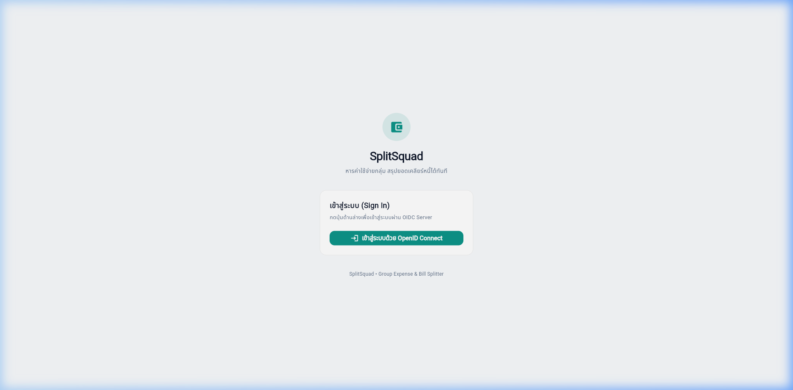
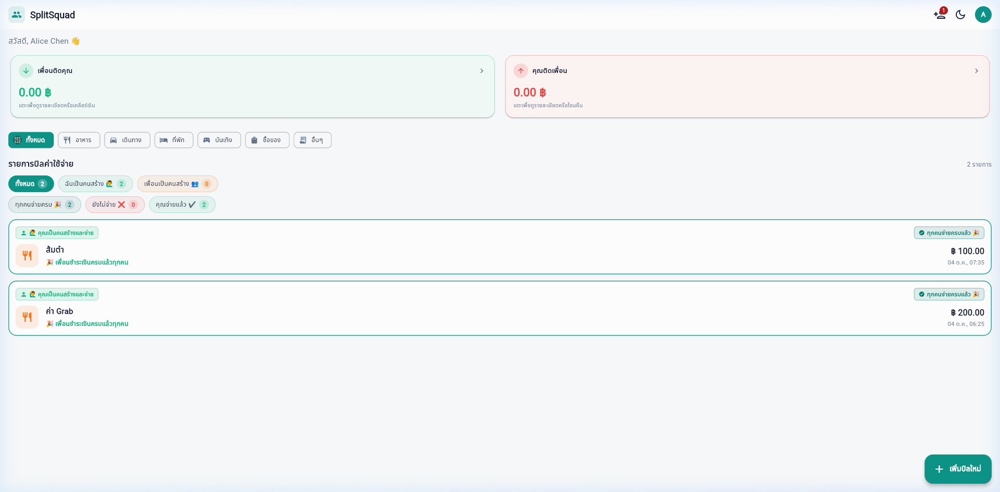

# 💸 SplitSquad — Group Expense & Bill Splitter

แอปพลิเคชันจัดการและหารค่าใช้จ่ายกลุ่มสำหรับเพื่อนร่วมทริป รูมเมท หรือเพื่อนร่วมงาน สรุปยอดค้างชำระอย่างตรงไปตรงมา (เพื่อนติดคุณ / คุณติดเพื่อน) พร้อมระบบแจ้งโอนและตรวจสอบยอดเงินแบบเรียลไทม์ เชื่อมต่อความปลอดภัยระดับสากลด้วย **OpenID Connect (OIDC)**

---

## ① ชื่อโปรเจกต์และคำอธิบาย (About Project)

### 📌 ปัญหาที่เราพบเจอ (The Problem)
เวลาไปเที่ยวต่างจังหวัดกับแก๊งเพื่อน ไปกินชาบูกับเพื่อนที่ทำงาน หรือแชร์ค่าหอกับรูมเมท มักเจอปัญหาชวนปวดหัวเสมอ:
- ต่างคนต่างช่วยกันจ่ายคนละบิล สับสนว่าใครจ่ายอะไรไปแล้วบ้าง
- คำนวณหายอดสุทธิยาก ต้องมานั่งกดเครื่องคิดเลขทอนเงินไปมา
- ความเกรงใจทำให้ลืมทวง หรือลืมว่าตัวเองยังติดเงินเพื่อนอยู่เท่าไร

### 🎯 เราแก้ปัญหาอย่างไร และใครคือผู้ใช้งาน? (The Solution & Audience)
**SplitSquad** ถูกสร้างขึ้นเพื่อกลุ่มเพื่อน นักศึกษา รูมเมท และเพื่อนร่วมงาน:
- ช่วยให้ทุกคนสามารถบันทึกบิลที่ตัวเองเป็นคนจ่าย เลือกว่ามีใครเป็นคนร่วมหารบ้าง
- สรุปยอดค้างชำระอย่างตรงไปตรงมาผ่าน 2 การ์ดหลัก: **"เพื่อนติดคุณ"** (เงินที่ต้องได้คืน) และ **"คุณติดเพื่อน"** (เงินที่เราต้องโอนคืน) โดยไม่นำยอดมาหักลบสุทธิให้สับสน
- แยกแยะสถานะบิลและสมาชิกอย่างชัดเจนด้วยป้ายสี: **🟢 จ่ายแล้ว**, **🔴 ยังไม่จ่าย**, **🟠 รอตรวจสอบ**, และ **🎉 ทุกคนจ่ายครบแล้ว (ปิดยอด 100%)**
- มีระบบ **แจ้งโอนเงิน และ เจ้าของบิลตรวจสอบยอด (Payment Verification Workflow)** ให้เพื่อนกดแจ้งโอน และเจ้าของบิลกดยืนยันรับเงินหรือปฏิเสธได้
- มีระบบตัดยอดหนี้อัตโนมัติ (**Debt Settlement**) ทั้งกรณีเราโอนคืนเพื่อน หรือเพื่อนโอนคืนเรา โดยรองรับการระบุจำนวนเงินและตัดบิลเก่าก่อนตามลำดับ (FIFO)

---

## ② ฟีเจอร์การใช้งาน (Features)

### ✨ ฟีเจอร์หลัก (Core Features)
- [x] **OIDC Authentication (PKCE Flow):** เข้าสู่ระบบผ่าน OpenID Connect Identity Provider (`django-oidc-provider`) ปลอดภัยตามมาตรฐานสากล รองรับการสลับบัญชีและล็อกเอาต์อย่างสมบูรณ์
- [x] **Persistent Session:** จำสถานะการเข้าสู่ระบบไว้ในเครื่อง ปิดแอปหรือรีเฟรชหน้าเว็บก็ยังใช้งานต่อได้ทันที
- [x] **Create Expense:** บันทึกบิลค่าใช้จ่าย ระบุชื่อ ยอดเงิน หมวดหมู่ หมายเหตุ และเลือกเพื่อนร่วมหารได้อิสระ พร้อมคำนวณส่วนแบ่งเฉลี่ยต่อคนแบบเรียลไทม์
- [x] **Clear Bill & Payment Status:** ระบุสถานะการจ่ายเงินชัดเจนทุกระดับ:
  - 🟢 **จ่ายแล้ว ✔️ / รับเงินครบแล้ว ✔️:** สมาชิกชำระเงินเรียบร้อย
  - 🔴 **ยังไม่จ่าย ❌ / รอเพื่อนจ่าย ❌:** ยอดเงินที่ยังค้างชำระ
  - 🟠 **รอตรวจเงิน ⏳:** มีการแจ้งโอนเงินเข้ามา รอเจ้าของบิลตรวจสอบ
  - 🎉 **ทุกคนจ่ายครบแล้ว (100% Closed):** บิลที่สมาชิกทุกคนเคลียร์ครบหมดแล้ว ปิดยอดสมบูรณ์
- [x] **Payment Notification & Verification Workflow:**
  - สมาชิกที่ค้างจ่ายสามารถกดปุ่ม **`[แจ้งว่าโอนแล้ว 💸]`** ในหน้ารายละเอียดบิล
  - เจ้าของบิลจะได้รับการแจ้งเตือน เพื่อตรวจสอบยอดเงินในบัญชี และมีปุ่มให้กด **`[ยืนยันรับเงิน ✔️]`** หรือ **`[ปฏิเสธ ❌]`**
- [x] **Bilateral Debt Settlement & FIFO:** 
  - เคลียร์หนี้ได้ทั้ง 2 ฝั่ง: **"ได้รับเงินแล้ว"** (เมื่อเพื่อนโอนให้เรา) หรือ **"โอนคืนแล้ว"** (เมื่อเราโอนให้เพื่อน)
  - สามารถกรอกจำนวนเงินที่ต้องการเคลียร์ได้ (กรณีคืนเงินเพียงบางส่วน) โดยระบบจะนำไปตัดบิลเก่าก่อนตามลำดับ (First-In, First-Out)
- [x] **Update & Delete Expense:** แก้ไขรายละเอียดบิล ยอดเงิน หรือผู้ร่วมหารย้อนหลังได้ พร้อมระบบลบบิลและการยืนยันป้องกันการกดผิด

### 🌙 ฟีเจอร์เสริมพิเศษ (Extra Features)
- [x] **Friend Request & Privacy Isolation:** 
  - ผู้ใช้งานสามารถสมัครบัญชีใหม่ได้ด้วยตนเอง
  - ระบบค้นหาและส่งคำขอเป็นเพื่อนผ่าน Username โดยผู้รับสามารถเลือก **ยอมรับ (Accept)** หรือ **ปฏิเสธ (Reject)** ได้
  - สามารถลบเพื่อน (Unfriend) และยกเลิกคำขอเป็นเพื่อนที่ส่งไปได้ พร้อมหน้าต่างยืนยันเพื่อความปลอดภัย
  - ระบบแยกบิลเป็นส่วนตัว (Privacy Isolation) แสดงเฉพาะบิลของผู้ใช้งานและเพื่อนที่เกี่ยวข้องกันเท่านั้น ผู้ใช้ใหม่จะไม่เห็นบิลของคนอื่น
- [x] **Smart Filter Tabs:**
  - กรองตามผู้สร้างบิล: **ทั้งหมด** | **ฉันเป็นคนสร้าง 🙋‍♂️** | **เพื่อนเป็นคนสร้าง 👥**
  - กรองตามสถานะการชำระ: **ทุกคนจ่ายครบ 🎉** | **ยังไม่จ่าย ❌** | **คุณจ่ายแล้ว ✔️** (กดเลือกเพื่อกรอง หรือกดซ้ำเพื่อยกเลิกการกรอง)
  - กรองตามหมวดหมู่ค่าใช้จ่าย: อาหาร, การเดินทาง, ที่พัก, บันเทิง, ช้อปปิ้ง, อื่นๆ
- [x] **Dark Mode (โหมดกลางคืน):** สลับธีมมืด/สว่างได้ง่าย ๆ ผ่านปุ่มพระจันทร์บนแถบ AppBar หรือหน้า Profile พร้อมจำค่าธีมไว้ในเครื่อง

---

## ③ เทคโนโลยีที่ใช้ (Tech Stack)

### 📱 Frontend (Mobile & Web)
- **Flutter Version:** `3.47.x` (Dart `3.13.x`)
- **State Management & DI:** `provider` (MVVM Architecture: Models, Views, ViewModels, Repositories, Services)
- **HTTP Client:** `dio` (Stateless Network Client พร้อมแนบ Bearer Token)
- **Local Storage:** `shared_preferences` (จัดการ Session Token และ Theme Mode)
- **Crypto & Security:** `crypto` (คำนวณ SHA-256 Code Challenge สำหรับ PKCE)
- **Date & Number Formatting:** `intl`

### 🖥️ Backend
- **Framework:** `Django 5.x` + `Django REST Framework`
- **Package & Environment Manager:** `uv` (Astral's extremely fast Python package manager)
- **OIDC Provider:** `django-oidc-provider` (มาตรฐาน OpenID Connect, RS256 JWT, PKCE S256)
- **CORS Handling:** `django-cors-headers`
- **Database:** `SQLite` (พร้อมระบบ Auto-seed ข้อมูลเริ่มต้น)

---

## ④ สิ่งที่ต้องติดตั้งก่อนรัน (Prerequisites)

ก่อนเริ่มต้นรันระบบ กรุณาตรวจสอบว่าในเครื่องมีโปรแกรมเหล่านี้ติดตั้งเรียบร้อยแล้ว:

1. **Python (เวอร์ชัน 3.10 ขึ้นไป)** — [ดาวน์โหลด Python](https://www.python.org/downloads/)
2. **uv (ตัวจัดการแพ็กเกจ Python)** — [คู่มือติดตั้ง uv](https://docs.astral.sh/uv/getting-started/installation/)
   *(สำหรับ Windows ติดตั้งผ่าน PowerShell: `powershell -ExecutionPolicy ByPass -c "irm https://astral.sh/uv/install.ps1 | iex"` หรือ `pip install uv`)*
3. **Flutter SDK (เวอร์ชัน 3.x ขึ้นไป)** — [คู่มือติดตั้ง Flutter](https://docs.flutter.dev/get-started/install)
4. **Google Chrome** — [ดาวน์โหลด Google Chrome](https://www.google.com/chrome/)

---

## ⑤ วิธีการรันระบบทีละขั้นตอน (How to Run)

เปิด **Terminal 2 หน้าต่าง** แล้วรันคำสั่งตามลำดับดังนี้:

### 🔹 Terminal 1: ฝั่ง Backend (Django OIDC Server)
```bash
# 1. เข้าไปที่โฟลเดอร์ backend
cd backend

# 2. ติดตั้ง Library ทั้งหมดผ่าน uv
uv sync

# 3. รัน Migration ฐานข้อมูล
uv run manage.py migrate

# 4. สร้างผู้ใช้ทดสอบและ OIDC Client เริ่มต้น
uv run manage.py seed_splitsquad_data

# 5. เริ่มต้นเซิร์ฟเวอร์ Backend ที่พอร์ต 8000
uv run manage.py runserver 0.0.0.0:8000
```
> เซิร์ฟเวอร์ Backend จะพร้อมทำงานที่ `http://127.0.0.1:8000`

---

### 🔹 Terminal 2: ฝั่ง Frontend (Flutter Web)
```bash
# 1. เข้าไปที่โฟลเดอร์ frontend
cd frontend

# 2. ดาวน์โหลดแพ็กเกจ Flutter
flutter pub get

# 3. ตรวจสอบความถูกต้องของโค้ดและการทดสอบ (Zero Issues)
flutter analyze
flutter test

# 4. รันแอปพลิเคชันบนเบราว์เซอร์ Chrome ที่พอร์ต 50000
flutter run -d chrome --web-port 50000
```
> เบราว์เซอร์จะเปิดแอป SplitSquad ขึ้นมาที่ `http://localhost:50000`

---

## ⑥ บัญชีสำหรับทดสอบ (Demo Accounts)

สามารถใช้บัญชีผู้ใช้ทดสอบด้านล่าง เพื่อล็อกอินที่หน้า OIDC Server:

| Username | Password | ชื่อที่แสดง | รายละเอียดในระบบ |
| :--- | :--- | :--- | :--- |
| **`alice`** | `alice123` | Alice Chen | *(แนะนำ)* มีทั้งยอดที่เพื่อนติดและยอดที่ติดเพื่อน เหมาะสำหรับทดสอบดู Balance |
| **`bob`** | `bob123` | Bob Smith | สมาชิกร่วมหารบิลค่าอาหารและทริป |


*ขั้นตอนการล็อกอิน: กดปุ่ม **"เข้าสู่ระบบด้วย OpenID Connect"** ที่หน้าแอป ระบบจะพาไปกรอก Username และ Password ที่หน้าเว็บของ OIDC Server เมื่อยืนยันตัวตนสำเร็จจะส่งกลับมาที่ Dashboard ทันที*

---

## ⑦ ภาพหน้าจอการทำงาน (Screenshots)

ตามเกณฑ์การประเมินโครงการ ได้แนบภาพหน้าจอสำคัญของระบบ SplitSquad ดังนี้:

### 📸 ภาพที่ 1: หน้าเข้าสู่ระบบและความปลอดภัย (OIDC Sign In)
หน้าจอเข้าสู่ระบบผ่าน OpenID Connect Identity Provider ตามมาตรฐาน PKCE S256 แสดงความปลอดภัยระดับสากล ไม่เก็บรหัสผ่านในเครื่อง และรองรับการสลับบัญชี/ล็อกเอาต์

<p align="center">
  
</p>

### 📸 ภาพที่ 2: หน้าแดชบอร์ดสรุปยอดหนี้และการกรองอัจฉริยะ (Dashboard Screen)
หน้าหลักสรุปยอดหนี้ผ่าน 2 การ์ดหลัก (**"เพื่อนติดคุณ"** และ **"คุณติดเพื่อน"**), แถบกรองหมวดหมู่, แถบกรองผู้สร้างบิล (ฉันสร้าง/เพื่อนสร้าง), แถบกรองสถานะการชำระ (`ทุกคนจ่ายครบ 🎉`, `ยังไม่จ่าย ❌`, `คุณจ่ายแล้ว ✔️`), พร้อมป้ายสถานะบิลและปุ่มเพิ่มบิลใหม่

<p align="center">
  
</p>

---

### 📋 ตารางสรุปโครงสร้างหน้าจอและฟังก์ชันการทำงาน (UI Screens & Workflows)

| หน้าจอหลัก | รายละเอียดและฟังก์ชันสำคัญ |
| :--- | :--- |
| **1. หน้าเข้าสู่ระบบและสมัครสมาชิก**<br>`(OIDC Sign In & Sign Up)` | • เข้าสู่ระบบผ่าน OpenID Connect Identity Provider ตามมาตรฐานความปลอดภัย PKCE S256<br>• สมัครบัญชีใหม่ได้ด้วยตนเองโดยไม่เก็บรหัสผ่านในเครื่อง<br>• มีปุ่มสลับบัญชีและล็อกเอาต์อย่างสมบูรณ์ |
| **2. หน้าแดชบอร์ดและการกรองอัจฉริยะ**<br>`(Dashboard & Smart Filters)` | • สรุปยอดหนี้ 2 การ์ดหลัก: **"เพื่อนติดคุณ"** (เงินที่ต้องได้คืน) และ **"คุณติดเพื่อน"** (เงินที่เราต้องโอน) ชัดเจน ไม่ทอนยอดให้สับสน<br>• แถบกรองผู้สร้างบิล: `ทั้งหมด` \| `ฉันเป็นคนสร้าง 🙋‍♂️` \| `เพื่อนเป็นคนสร้าง 👥`<br>• แถบกรองสถานะบิล: `ทุกคนจ่ายครบ 🎉` \| `ยังไม่จ่าย ❌` \| `คุณจ่ายแล้ว ✔️` (กดเลือกเพื่อกรอง หรือกดซ้ำเพื่อยกเลิกการกรอง)<br>• ป้ายสถานะชัดเจนทุกระดับ: 🟢 จ่ายแล้ว, 🔴 ยังไม่จ่าย, 🟠 รอตรวจเงิน, 🎉 ทุกคนจ่ายครบแล้ว (100% Closed) |
| **3. หน้ารายละเอียดบิลและระบบแจ้งโอน**<br>`(Expense Detail & Verification)` | • แสดงรายชื่อผู้ร่วมหารและสถานะการจ่ายเงินแยกรายบุคคล<br>• ปุ่ม **`[แจ้งว่าโอนแล้ว 💸]`** สำหรับลูกหนี้เพื่อแจ้งเจ้าของบิล<br>• ปุ่ม **`[ยืนยันรับเงิน ✔️]`** และ **`[ปฏิเสธ ❌]`** สำหรับเจ้าของบิลตรวจสอบยอดเงิน |
| **4. หน้าเพิ่มและแก้ไขบิลค่าใช้จ่าย**<br>`(Add / Edit Expense Form)` | • ฟอร์มกรอกชื่อบิล เลือกหมวดหมู่ค่าใช้จ่าย และระบุยอดเงิน<br>• เลือกเพื่อนร่วมหารได้อิสระ พร้อมระบบคำนวณและเฉลี่ยยอดเงินต่อคนแบบเรียลไทม์ |
| **5. หน้าระบบเพื่อนและความเป็นส่วนตัว**<br>`(Friends & Privacy Isolation)` | • ค้นหาเพื่อนด้วย Username และส่งคำขอเป็นเพื่อน<br>• จัดการคำขอเข้า/ออก (ยอมรับหรือปฏิเสธคำขอ)<br>• ระบบแยกข้อมูลบิลเป็นส่วนตัว เห็นเฉพาะกลุ่มเพื่อนที่เชื่อมต่อกันเท่านั้น |
| **6. หน้าโปรไฟล์และการเคลียร์หนี้**<br>`(Profile & Debt Settlement)` | • สรุปยอดค้างชำระรายบุคคล พร้อมปุ่มเคลียร์หนี้ (Debt Settlement)<br>• เลือกว่า "เราโอนคืนเพื่อน" หรือ "เพื่อนโอนคืนเรา" พร้อมระบบตัดบิลเก่าก่อนตามลำดับ (FIFO)<br>• สวิตช์สลับโหมดมืด (Dark Mode 🌙) บันทึกการตั้งค่าลงเครื่อง |

---

## ⑧ 🎬 วิดีโอนำเสนอผลงาน (Demo Video)

- **ลิงก์วิดีโอสาธิตการทำงาน (YouTube / Google Drive):**  
  👉 **`https://youtu.be/hwwtz8hAN74`** 

---

